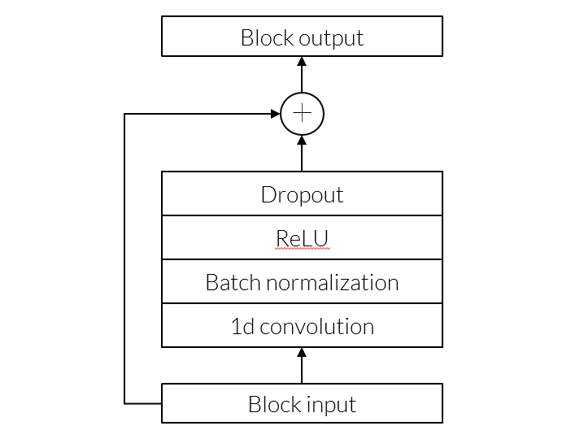
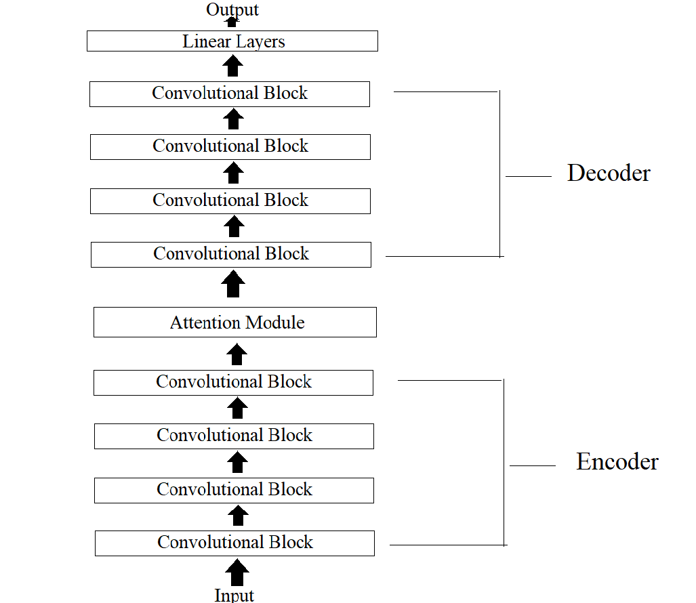
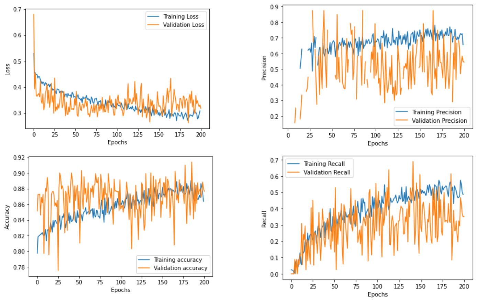
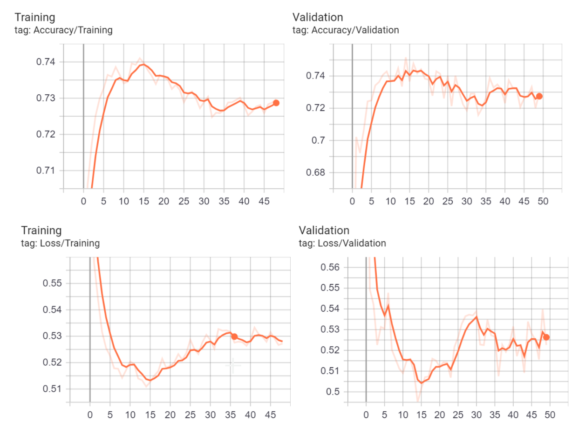

# DVC Accent Classifier
[Return to Home](index.md)
## Contents:
- [Introduction](#introduction)
- [Architecture](#architecture)
- [Data](#data)
- [Initial Experiments](#Initial Experiments)
- [Training](#training)
- [Evaluation](#evaluation)
- [Visualizations](#Visualizations)
- [Results](#results)
- [Conclusion](#conclusion)

## Introduction
This part of the project is the accent classifier which is a convolutional neural network that takes in input audio and classifies the speech as either an American English or non-American English accent. The goal of this is to see
if it is possible to locate the certain sounds to find what the network distinguishes as non-American English and to provide that as input to the user. We trained our model initially on the Speech Accent Archive and later the Mozilla Common Voice dataset.

## Architecture
The accent classifier is a feed-forward convolutional neural network that contains an 
attention module in between an encoder and decoder. The attention module is attending to frames from the audio that the model believes have the highest indication of being an American English accent. The basis of the model is a convolutional block which has a 1D convolutional layer followed by batch normalization, ReLU, and dropout. A diagram for a block is shown below.

There are 4 sequential convolutional blocks in the encoder where each block 
passes its output to the next block. The final output for the encoder is passed into the attention module where this output passes through three independent linear layers. These linear layers are labeled W_q, W_k, and W_v. The outputs of these layers are used to calculate attention with the formula seen below.

Here **d** represents the length of the output x. Attention(x) is then passed into the decoder which also consists of 4 sequential convolutional blocks. The output of the final block is passed into two sequential linear layers, and the final output is the probability that the audio is the American English Accent. An image showcasing the full structure of this model is below. 

## Data
For our initial experiments, we used the Speech Accent Archive provided [here](https://www.kaggle.com/rtatman/speech-accent-archive). The dataset has 1GB MP3 files with 214 accents from 177 countries. All speakers spoke the exact same sentences and the audio clips are usually 20-40 seconds long. These MP3 files are labeled through their filenames which contains the accent name and the corresponding accent number. The data has an associated CSV that gives information such as speaker id, origin, and location.

We transitioned into using the Mozilla Common Voice Dataset found [here](https://commonvoice.mozilla.org/en/datasets). This dataset includes 1,400 hours of validated English speech and transcripts by 60,000+ speakers with accent labels for 700+ hours. We will only use labeled data, and we simplify the classification to binary labels of American English and not American English. The data is structured in a CSV file that includes the relative path to the audio file, transcript, age, gender, and accent. The audio files are provided in the MP3 format. The target accent, American English, consists of 55% of the Mozilla Common Voice dataset. 

The preprocessing for accent classification will turn each audio file into log-melspectograms. A full detailed description of melspectograms and log-melspecotgrams can be found [here](https://medium.com/analytics-vidhya/understanding-the-mel-spectrogram-fca2afa2ce53). We will generate the melspectograms from the dataset using librosa package, and the melspectogrms will have hop-lengths of 160, window lengths of 1024, length of FFT windows of 1024, and have 80 melspectogram bins. The model will train using randomly selected chunks of the same size from these melspectograms that are collated to create the batch.

## Initial Experiments
We wanted to verify that the attention module improved the overall performance of 
model. To test this, we trained a model where the architecture contained no attention module
and compared it's performance to one that contained the module. For this training,
we used the Speech Accent Archive and used a chunk size of 2 seconds. We concluded that 
the Attention helped improve model performance. The results for this experiment are below.

 | Model | Accuracy| Loss | 
 |:-----:|:------:|:--------:|
 |Model With Attention|.903| .259|
 |Model Without Attention|.864|.283|
 
 *This table shows the best loss during training for models  with  and  without  Attention. It  also  shows  the  corresponding accuracy at that loss*
 
Using the Speech Accent Archive, we conducted an experiment
to find the best chunk size for training. 
Chunk-size is the length, in seconds, of an item that
is in the training batch. For these runs, we trained on 1, 2, and 4 second chunk sizes and
used the standard architecture with an attention module.
We concluded that the two second chunk size had the best performance
 in terms of trade-off as the 4 second chunk size took much longer for training.

 | Chunk Size that Model is Trained on| Accuracy| Loss | 
 |:-----:|:------:|:--------:|
 |1 Second|.867| .363|
 |2 Second|.906|.283|
 |4 Second|.917|.236|
 
 *This table shows the best loss during training for models that were trained on 1, 2, and 4 second chunks of audio.It also shows the corresponding accuracy at that loss*

## Training
For all the training runs below, the accuracy, recall, and precision graphs were created with the same process.
The model outputs probabilities an item is American English accent for every item in the batches, and these probabilities were rounded 
so that they were 1 or 0. 
These are the predicted labels, and the true labels from the csv (American English = 1, non-American English = 0)
were used to count the number of true positives, false positives, true negatives, and false negatives per epoch.

These values were then used to calculate the accuracy, precision, and recall. Additionally, all loss was calculated using binary cross entropy loss. All of the following models
were trained using a chunk size of 2 seconds and with an architecture that uses the
attention module.

The first set of graphs showcase the training run using the data from the Speech Accent Archive. 
The target Accent was American English which was 80% of this dataset. This training run had a max epoch of 200.

*Loss (top left), Precision (top right), Accuracy (bottom left), and Recall (bottom right) for 
the final training run using the Speech Accent Archive.*

We had a training run for the Mozilla Common Voice dataset with max epoch of 50. The 
target accent (American English) was 55% of this dataset.
The associated tensorboard can be found [here.](https://tensorboard.dev/experiment/ZvyEUeHaRMGXJQS86l1H1w/#scalars)

*The top left is the accuracy over epochs for training, top right is accuracy over epochs for validation, bottom left is loss over epochs for training, and bottom right is loss over epochs for validation.*

*The top graph is for precision for both training and validation, and the bottom graph is for recall for both training and validation. The minimum loss occurred at 15. This checkpoint was used for later evaluation.*
## Evaluation
After analyzing the initial training run on the Speech Accent Archive, we noticed that although
the accuracy was high the precision and recall were lower than what would indicate that the model was pe
reforming well as the target accent was 80% of the dataset. Validation precision was
inconsistent through training and the validation recall values stayed below .5. This indicated 
that model training on this dataset underperformed and was not able to distinguish
American English Accent and non-American English accents well. We believe this largely being due to the dataset being small, having
a large amount of non-native English speakers that, and that all the speakers spoke the same language.

| | Loss | Accuracy| Precision| Recall| 
|:-----:|:-----:|:------:|:--------:|:--------:|
|Speech Accent Archive| .31 | .90 | .3| .4|

As a result, we moved to using the Mozilla Common Voice dataset which was significantly larger and had a much more 
greater variety of spoken words due to each speaker using different texts. The highest accuracy for this dataset
was around 74%, but the precision value was around 80% during and around 70% for recall which indicated
 the model had much better performance than the training run that used the Speech Accent Archive. Additionally,
 since the target accent was 55% dataset these values indicated the model was learning and was able 
 to distinguish between non-American English and American English. 

 
| | Loss | Accuracy| Precision| Recall| 
|:-----:|:-----:|:------:|:--------:|:--------:|
|Mozilla Common Voice| .51 | .74 | .80| .72|

 
##Visualizations
  
For all the following visualizations, we used a checkpoint from the training run using the Mozilla Common Voice Dataset where the the max epochs was 50.

###Attention 
We created visualizations of the attention weights to see if we could gather any insights into what the model was attending. These attention visualizations had dimensions that were the number of frames by number of frames where the number of frames is equivalent to frames in each audio chunk (1 second = 100 frames). 

We concluded that where there are horizontal 'lines' on the visualization was where the horizontal axis was attending to a single frame from the vertical axis. However, we could not retrieve any conclusive results from these visualizations that indicated that the model was distinguishing different accents.
 
We did find that that the 'lines' in the visualizations were moving upward when passed sequential chunks which signified there was a pattern in the model and it was attending to the same frames. In the visualizations below, the visualizations of module below which was passed sequential chunks that started .5 seconds apart, we can see that the lines move approximately 50 frames, equivalent to .5 seconds, upward.

| Attention for 2 second chunk starting at 0 seconds| Attention for 2 second chunk starting at .5 seconds| Attention for 2 second chunk starting at 1 seconds | 
|:-----:|:------:|:--------:|
||| |

*These images are the visualizations for the attention a 1.5 audio clip that has an Australian accent. From left to right these visualizations go in sequential order for increments of .5 seconds and each is 2 seconds (201 frames).*

###Probabilities

We created additional visualizations by passing audio files into the model and retrieving the 
probability that given audio were American English. 
The audio file was converted into a melspectogram and two second chunks incremented by .5 seconds
were passed sequentially into the model. 
The graph generated was the probabilities for the chunk plotted against where that 
chunk started. 

The first audio file that was tested on was an American English Accent which can be found [here](audio/ShortEnglish.mp3).

The probability over time graph for this given audio file is below. This graph has the words
 annotated across the bottom the time they were first spoken and the probabilities on the left. 

From this visualization, we found that for most of the audio the model associated a probability of greater than .5 and the average of the probability for the chunks was .63. Although the average was not as high as it should be considering that it was spoken by a native English speaker, it did show the model had some success in correctly classifying.

*An annotated graph of the probabilities against where the chunk starts for an 
audio file where the speaker speaks only English in an American accent. 
The annotations at the bottom are the speech in the audio file and are approximated for where each words begins and ends.*

We also tested transitioning from an American English Accent to French in the same audio clip. The audio can be found [here](audio/EngFrench.mp3).
The probability over time graph for this given audio file is below.

This example switches languages at the 21 second mark from American English to French. Here, we can see a drop off in probability that indicates that it was able to tell the change of language. The average probability for the first 20 seconds (American English portion) of the audio is .62 while the last 30 seconds (or the French portion) had an average probability of .45. Once again, this change in probability indicates that the language
did to an extent learn the differences between the accents. However, the number of 
similar phonemes in the languages could be the reason that there is not a larger
difference between the two probabilities.

*This is a graph of the probabilities for each chunk against where the chunk starts for an audio file where the speaker starts by speaking in an American English accent*

This one is harder to annotate due to the speed of speaking and length of sentences but the English
portion of the audio is: 

**"This is another example audio of me transitioning 
from English to another Language slash accent. This time I'm going to do a French
Accent and also use a piece of French text to make it easier instead of free-forming
 as I was doing previously. Um - I will start  the text approximately in 
 5 seconds. Okay."**

Calculating the averages from these probablities on different peices of texts
showed that 

## Conclusion

