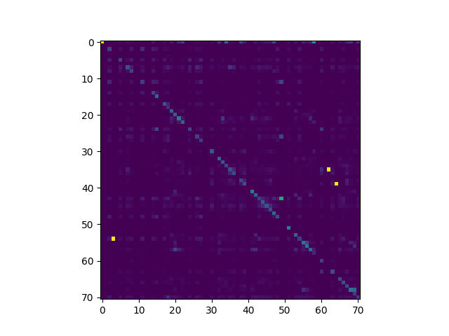
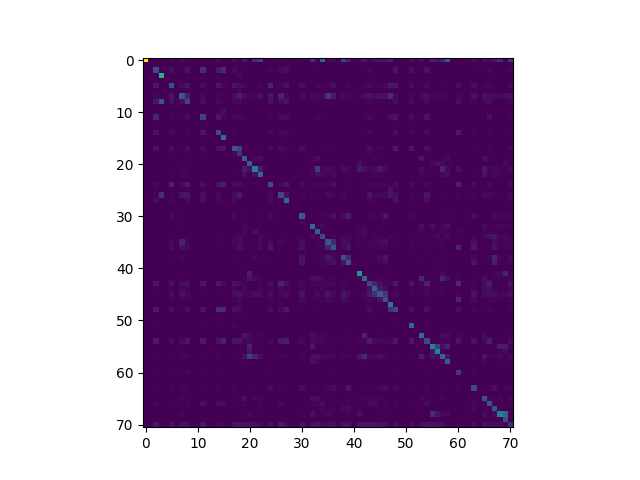
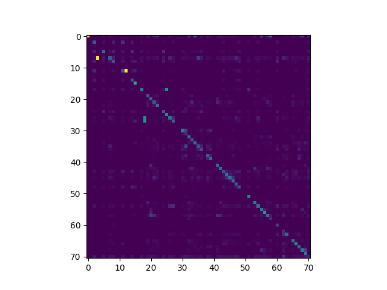

# DVC Phoneme Classifier
[Return to Home](index.md)
## Contents:
- [Introduction](#introduction)
- [Architecture](#architecture)
- [Data](#data)
- [Training](#training)
- [Evaluation](#evaluation)
- [Results](#results)
- [Conclusion](#conclusion)

## Introduction
The introduction goes here

blah

blah

blah

## Architecture
Description of the model architecture goes here

blah

blah

blah

## Data
Description of the data goes here

blah

blah

blah

## Training
Description of training process goes here

blah

blah

blah

## Evaluation
Description of evaluation process goes here

blah

blah

blah

## Results
Analysis of results goes here

#### Confusion Matrices
|  &nbsp;  |  Mixed testing data  |  Target testing data  |
|:--------:|:------------:|:-------------:|
|Model trained with mixed data|||

|Model trained with target data|||

Here, we show the confusion matrices. Along the horizontal axis, we have the actual phoneme class. Along the vertical axis, we have the predicted phoneme class. The confusion matrix was computed by counting each predicted-actual phoneme combination, then dividing by the total number of times the actual phoneme appears. Thus, each cell's color represents a percentage of predicted phoneme for each actual phoneme. The color scale goes from purple to green too yellow, where a yellow cell means that when the actual phoneme was the phoneme associated with that column, the predicted phoneme was very often the phoneme associated with that row.

## Conclusion
Conclusion goes here
