# DVC Phoneme Classifier
[Return to Home](index.md)
## Contents:
- [Introduction](#introduction)
- [Architecture](#architecture)
- [Data](#data)
- [Training](#training)
- [Evaluation](#evaluation)
- [Results](#results)
- [Conclusion](#conclusion)

## Introduction
Users learning a target accent likely would want precise feedback on which phonemes they pronounce differently from the target accent. For this part of the Deep Voice Coach, we explored a phoneme classifier. We train two models, one with the target accent, and one with a mix of different accents. Then, we compare how these models do at classifying phonemes given test data with the target accent and other accents. Ideally, the model trained on the target accent will more confidently and correctly classify phonemes of the target accent, but may perform worse with other accents. By comparison, we hope to see a smaller performance and confidence gap with the model trained on mixed accents. Using these two models, we hope to be able to identify phoneme-level accent errors in user speech.

## Architecture
The model architecure is based on the neural network used by DeepSpeech 2, consisting of two one-dimensional convolutional layers, each followed by batch normalization and ReLU activation. After those layers, the model has three bidirectional GRU layers, then a fully-connected layer. All layers use 512 channels. The output of the network is a 71-element vector where each element corresponds to one of 71 possible phonemes, which includes silence and noise.

We use a cross-entropy loss function between the predicted phoneme and ground truth phonemes to train the network. The cross-entropy loss is weighted to decrease the value of predicted silences, because silences are far more common than any other phoneme. The weights discourage the network from learning to always predict silence.

## Data
The experiments use the Mozilla Common Voice Dataset \cite{ardila2019common}, found [here](https://commonvoice.mozilla.org/en/datasets). This dataset includes 1,400 hours of validated English speech and transcripts by 60,000+ speakers, with accent labels for 700+ hours. We will only use labeled data, and we simplify the classification to binary labels of American English and not American English. The data is structured in a CSV file that includes the relative path to the audio file, transcript, age, gender, and accent. The audio files are provided in the MP3 format.

The data we used was selected randomoly from the Mozilla Common Voice Dataset and split into six disjoint partitions:
1. 50 hours of only the target accent (American English) for training
2. 10 hours of only the target accent for validation
3. 10 hours of only the target accent for testing
4. 50 hours of mixed accents for training
5. 10 hours of mixed accents for validation
6. 10 hours of mixed accents for testing

Audio clips are downsampled to 16 kHz and preprocessed to melspectrograms with 80 Mel-frequency bins with 1024 samples per window and 160 samples per hop. We generate melspectrograms for all of the audio data, choosing a random five second chunk if the audio file is longer than five seconds. These melspectrograms serve as the input for our neural network. The melspectrogram shows the frequencies for a particular 10 millisecond frame, and the model predicts a phoneme for each frame of the melspectrogram.

We extract ground truth phonemes using the Montreal Forced Aligner (MFA). MFA produces an alignment between the phonemes derived from the text and the speech audio, such that each phoneme is labeled with a start and end time at which it occurs in the audio. We one-hot encode the phoneme labels and upsample each one-hot vector to the number of 10 millisecond frames occupied by the phoneme. This means that each frame of the input spectrogram is aligned with the phoneme occurring during that frame. There are 71 phoneme categories, including silence and noise.

## Training
We trained two models, one using the target accent training and validation partitions, and another using the mixed accent training and validation partitions. The training is completed with a gradient clipping value of 0.5 and an Adam optimizer with a learning rate of 1e-3. We trained the models for 100 epochs.

We used gradient clipping due to a significant stabilization in the training loss and accuracy. Below, we show the graphs for training with and without gradient clipping using the target accent data. When we used gradient clipping, the learning appears to always start very slowly. During this time, the network almost always predicts a small handful of phonemes, especially silence. We hypothesize that the weights are slowly growing during this time until the much faster learning begins. For both models, the validation accuracy and loss becomes very unstable at this point. This may be due to having a validation dataset that is too small, and future training with a larger validation set is planned. In general, the model trained on only the target accent is able to achieve a higher best accuracy.

|  &nbsp;  |  Target data, no gradient clipping  |  Target data, gradient clipping  |  Mixed data, gradient clipping  |
|:--------:|:------------:|:-------------:|:------------:|
|Training Accuracy|[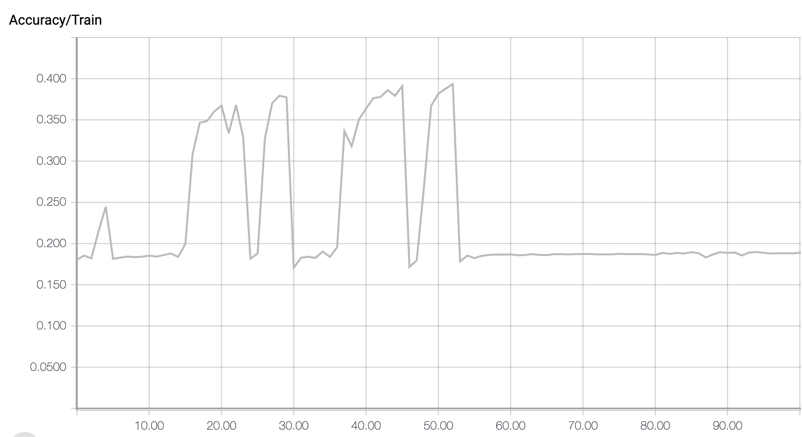](images/dvcpc_training_graphs/NoClipTrainAcc.png)|[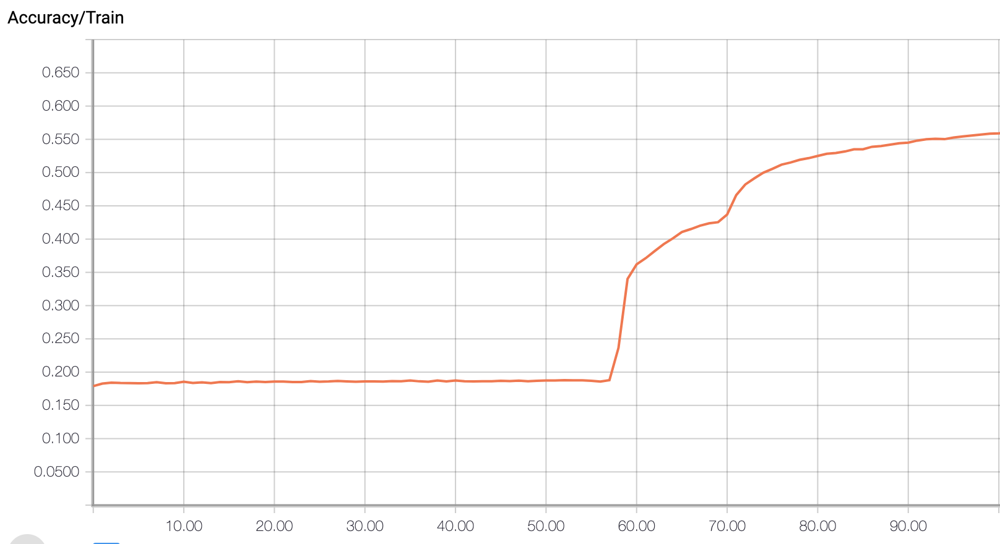](images/dvcpc_training_graphs/TargetClipTrainAcc.png)|[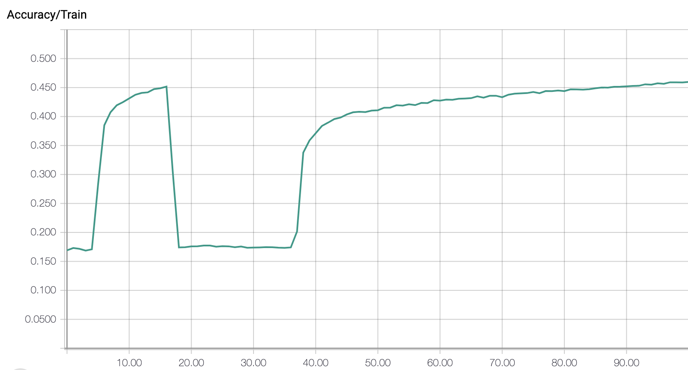](images/dvcpc_training_graphs/MixClipTrainAcc.png)
|Validation Accuracy|[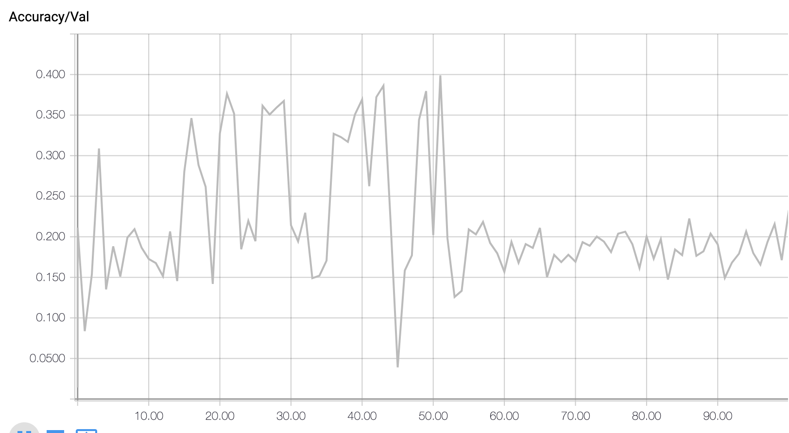](images/dvcpc_training_graphs/NoClipValAcc.png)|[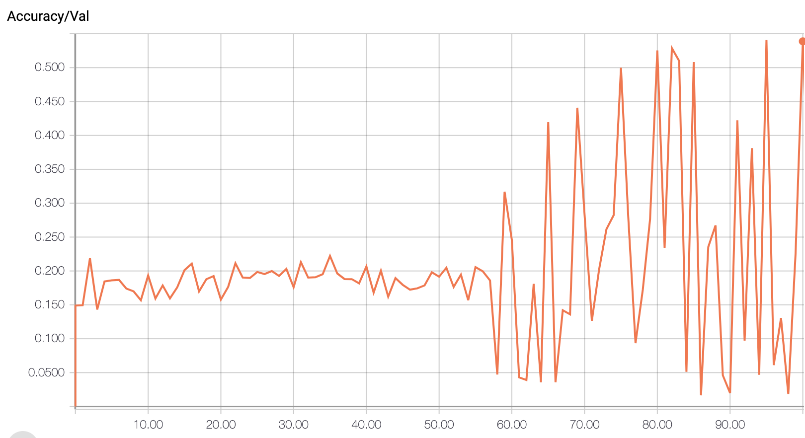](images/dvcpc_training_graphs/TargetClipValAcc.png)|[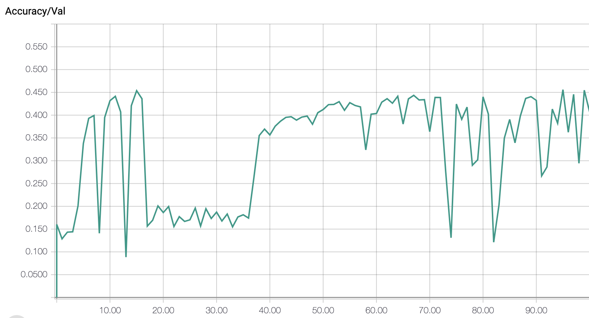](images/dvcpc_training_graphs/MixClipValAcc.png)
|Training Loss|[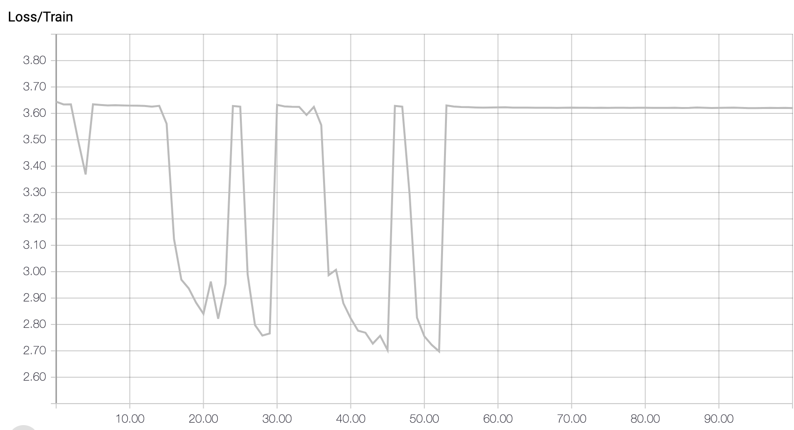](images/dvcpc_training_graphs/NoClipTrainLoss.png)|[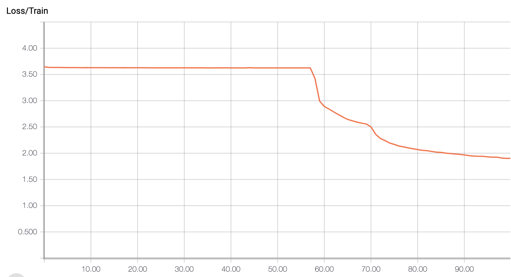](images/dvcpc_training_graphs/TargetClipTrainLoss.png)|[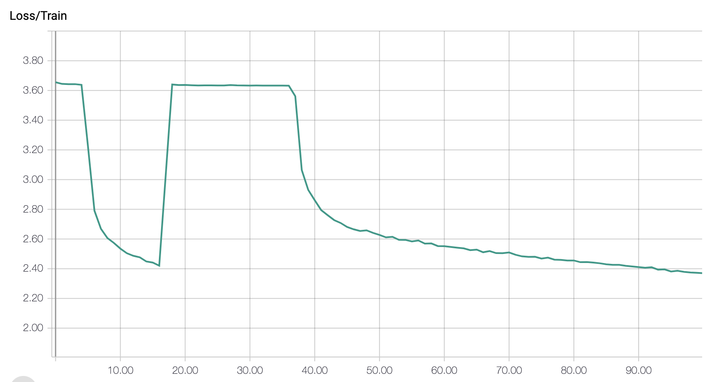](images/dvcpc_training_graphs/MixClipTrainLoss.png)
|Validation Loss|[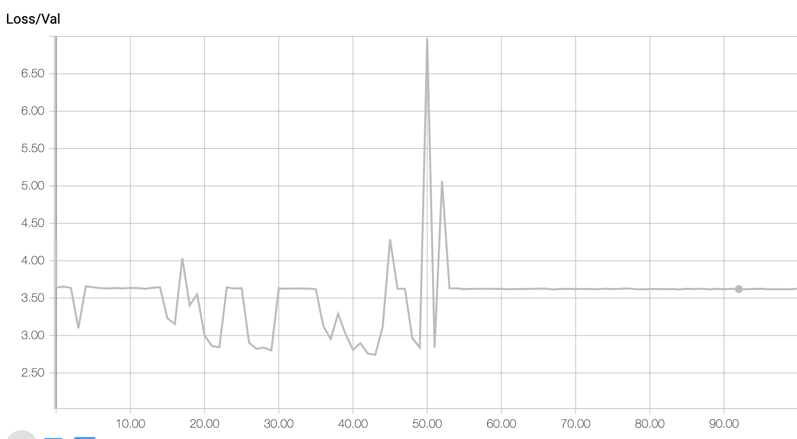](images/dvcpc_training_graphs/NoClipValLoss.png)|[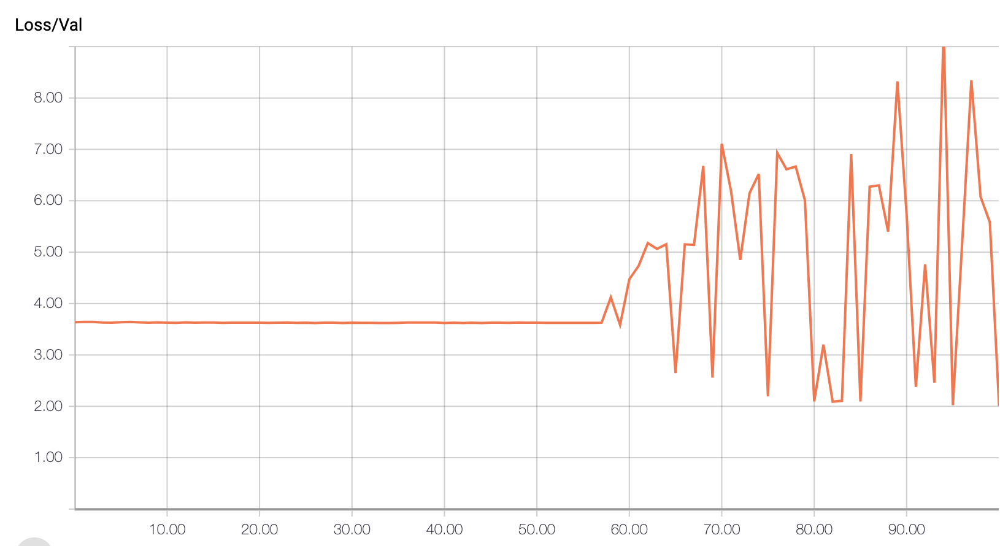](images/dvcpc_training_graphs/TargetClipValLoss.png)|[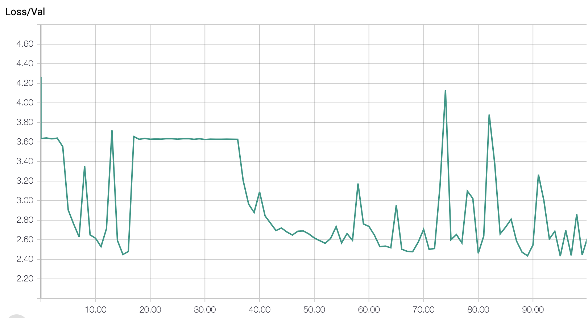](images/dvcpc_training_graphs/MixClipValLoss.png)

*These are the graphs show the accuracy and loss for three different training runs. The x axis is the epoch. Accuracy graphs plot average accuracy on the y axis, computed as the number of correctly predicted phoneme frames divided by the total number of frames. Loss graphs plot the cross-entropy loss on the y axis.*

Note that you can click on an image to see it in full-size.

## Evaluation
To evaluate the model, we tested both the target-trained and mixed-trained models against both the target accent and mixed accent testing data. We trained using the saved model weights at the point with the lowest validation loss from training–

Quantitatively, we look at the performance of each model on the target and mixed testing data. We investigate whether the target-trained model performs better on the target accent testing data compared to the mixed accent testing data. We also investigate how target-trained model's performance gap on the target and mixed accent testing data compares to the mixed-model's performance gap. A larger performance gap might suggest that the target-trained model has learned phoneme nuances that are specific to the target accent by training exclusively with the target accent.

Qualitatively, we manually inspect a random few audio files from the test set. For these, we plot the model's confidence for each frame in the audio file. For each frame of the melspectrogram input, the network outputs a 71-element vector where each value corresponds to how much the model thinks the frame is that particular phoneme. We take a softmax of this vector, then choose the maximum softmaxed value to represent the confidence on that particular frame. We hope to see lower confidence in frames where accent errors occur for the target-trained model.

## Results

#### Accuracy and Loss
First, we will look at the overall statistics from testing.

| Model | Accent | Accuracy | Loss |
|:-----:|:------:|:--------:|:----:|
|Mixed-trained|Mixed|0.442|2.471|
|Mixed-trained|Target|0.455|2.399|
|Target-trained|Mixed|0.504|2.230|
|Target-trained|Target|0.534|2.033|

*This table shows the testing accuracy and loss for each combination of model and type of testing data (mixed or only target)*

Here, we show the average testing accuracy and loss for both models with both testing data partitions. While both models improved slightly with the target accent testing data, the target-trained model had a slightly larger accuracy performance gap of 3%, compared to the mixed-trained model's 1.3% performance gap. In general, the target-trained model performed better than the mixed-trained model, even on the mixed accent testing data. This may be due to a larger proportion of American English accents relative to other accents in the mixed accent testing data.

#### Confusion Matrices
Next, we analyze confusion matrices that show the relationship between actual and predicted phonemes for each test run.

|  &nbsp;  |  Mixed testing data  |  Target testing data  |
|:--------:|:------------:|:-------------:|
|Mixed-trained model|[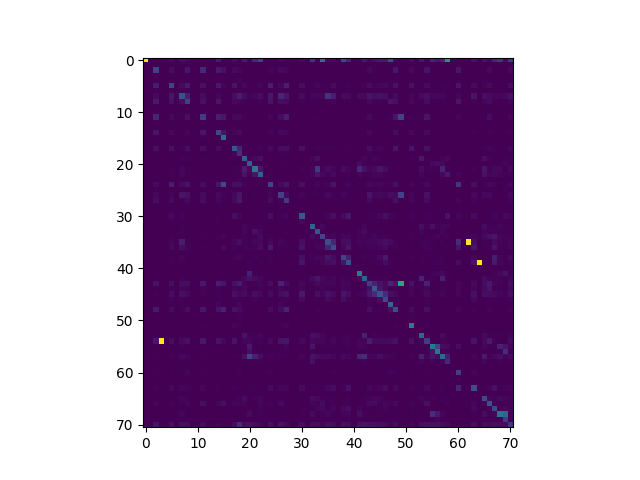](images/dvcpc_test_results/mixedmodel-mixeddata/percent_confusion_matrix.png)|[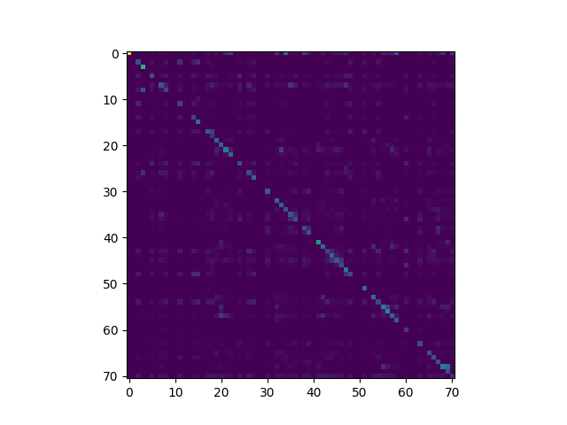](images/dvcpc_test_results/mixedmodel-targetdata/percent_confusion_matrix.png)|
|Target-trained model|[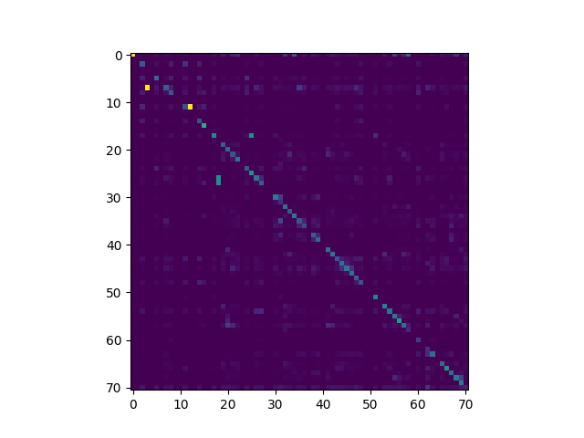](images/dvcpc_test_results/targetmodel-mixeddata/percent_confusion_matrix.png)||

*These are the confusion matrices, showing the relationship between actual phoneme class (horizontal) and predicted phoneme class (vertical) for each coombination of model and type of testing data (mixed or only target).*

Here, we show the confusion matrices. Along the horizontal axis, we have the actual phoneme class. Along the vertical axis, we have the predicted phoneme class. The confusion matrix was computed by counting each predicted-actual phoneme combination, then dividing by the total number of times the actual phoneme appears. Thus, each cell's color represents a percentage of predicted phoneme for each actual phoneme. The color scale goes from purple to green too yellow, where a yellow cell means that when the actual phoneme was the phoneme associated with that column, the predicted phoneme was very often the phoneme associated with that row.

There are a few notable observations. First, both models are very good at predicting silence, which is phoneme 0. Second, many related phonemes are frequently confused, and this can be seen with small slightly bright squares along the diagonal. For example, all four examples have a small 2x2 square at phoneme 35 and 36, which are IH0 and IH1 respectively. These seem to be related or similar phonemes, and as such, they are commonly confused. In general, the target-trained models have stronger diagonals, especially with the target testing data, which is consistent with the overall performance statistics.

#### Frame-by-frame Analysis

Lastly, we will manually analyze two specific examples. One of these is American English, and the other is not. The first example is American English, and you can listen to it [here](audio/common_voice_en_17945591.wav). The speaker says, "It is a fact".

| Model | Graphs |
|:-----:|:------:|
|Mixed-trained|[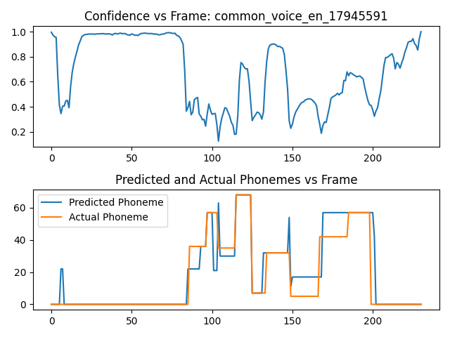](images/dvcpc_test_results/mixedmodel-targetdata/target_confidence_common_voice_en_17945591.png)|
|Target-trained|[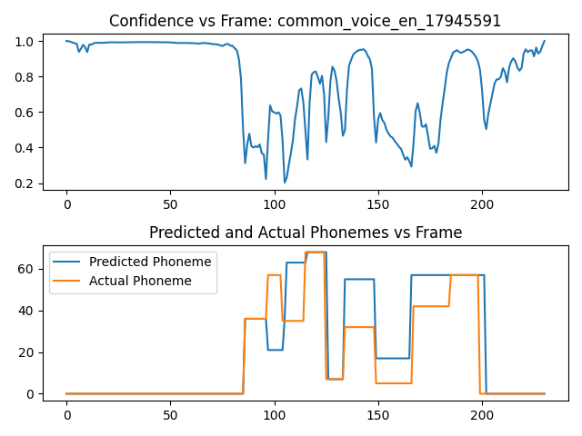](images/dvcpc_test_results/mixedmodel-targetdata/target_confidence_common_voice_en_17945591.png)|
*The confidence graphs plots the confidence, computed by the max of the softmax of the network's output vector, for each frame of the audio clip. The phoneme graphs plot the predicted (blue) and actual (orange) phonemes for each frame of the audio clip.*

In general, the target-trained model is more confident than the mixed-train model, even though it is not necessarily more accurate on this example. Both models are very confident on the silence. In general, the confidence is quite noisy, and seems to sharply drop between phonemes, which makes sense because the speech itself is transitioning between phonemes.

There are several other specific observations. At around frame 100, we have the "T" phoneme from "it", which the target-trained model misclassifies as a "D" phoneme. Confusing the "T" and "D" phonemes may be a nuance of the American English accent. At around frame 140, there is a large spike in confidence for both models, which is the phoneme "F" in "fact". At around frame 170, both models misclassify the "K" phoneme of "fact", classifying the whole section as "T". However, the confidence increases when the actual phoneme is "T" shortly afterwards, especially in the target-trained model.

The second example is not American English, and you can listen to it [here](audio/common_voice_en_76209.wav). The speaker says, "What will the weather be in Idaho".

| Model | Graphs |
|:-----:|:------:|
|Mixed-trained|[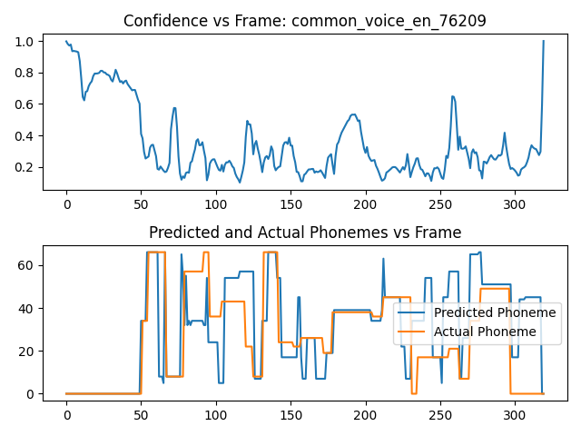](images/dvcpc_test_results/mixedmodel-targetdata/target_confidence_common_voice_en_76209.png)|
|Target-trained|[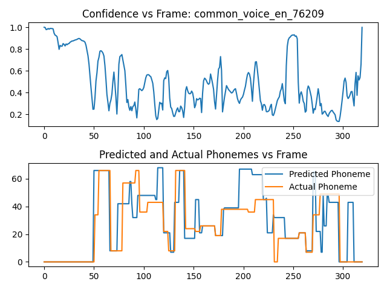](images/dvcpc_test_results/mixedmodel-targetdata/target_confidence_common_voice_en_76209.png)|
*The confidence graphs plots the confidence, computed by the max of the softmax of the network's output vector, for each frame of the audio clip. The phoneme graphs plot the predicted (blue) and actual (orange) phonemes for each frame of the audio clip.*

The confidence on this example is generally lower than the previous example. It also seems slightly more complicated, but again we see the same spike pattern. Some of the confidence spikes seem to correspond to correct classifications, but others do not. Even though this example is not American English, we still see a higher confidence with the target-trained model, which makes it hard to distinguish. The highest confidence spike in the target-trained model occurs at around frame 250, which is the "AY1" phoneme at the start of "Idaho". The speaker pronounces this with an "H" sound just before, which the target-trained model classifies just before the confidence spike.

## Conclusion
The phoneme classifier experiments yielded mixed results. Given that this is a classification problem with 71 classes, both models learned reasonably well, evidenced by decent accuracy and promising confusion matrices. Nevertheless, the validation instability in the training results should be further explored, possibly by adding more training or validation data. It is unclear to what extent the models overfit, because they still performs equally well on testing data.

As hypothesized, there was a larger performance gap for the target-trained model compared to the mixed-trained model; however, this gap is relatively small. The bigger the gap is, the more confidently we can say that the target-trained model is specifically tailored to classify the American English pronunciation of phonemes. Exploring a mixed dataset that has fewer American English examples might yield clearer results, although the overall accuracy of the mixed-trained model would likely decrease. 

The frame-by-frame confidence, while interesting, does not seem to show anything extremely promising. The confidence gap does not seem clear enough to allow the model pair to identify phoneme-level accent errors reliably, especially not without a ground-truth phoneme.

Overall, this exploration into phoneme classification may show potential in helping with accent classification, but further research would be necessary to accomplish the original goal of identifying phoneme-level accent errors.
